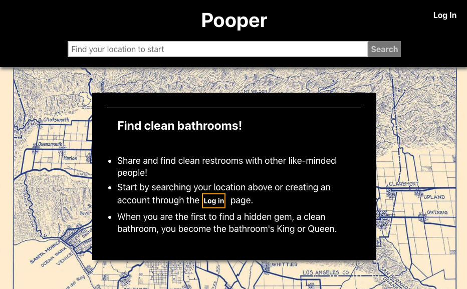
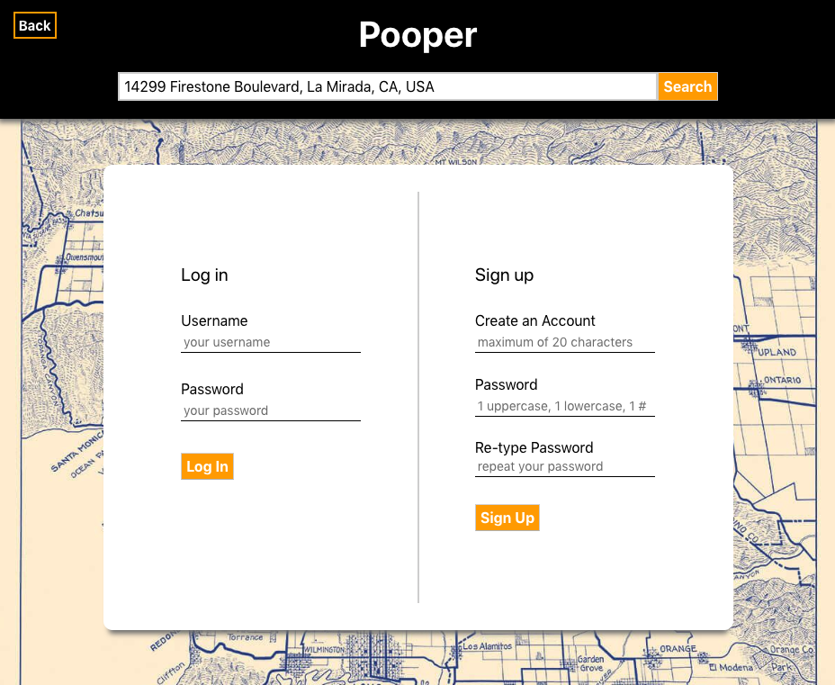
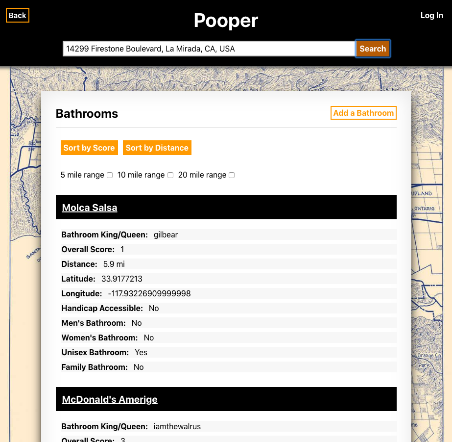
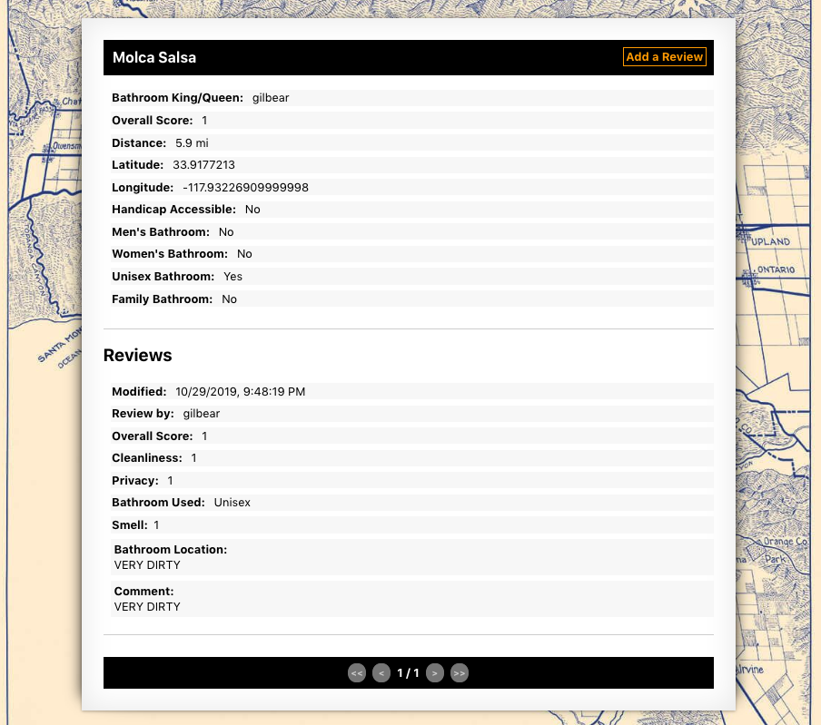
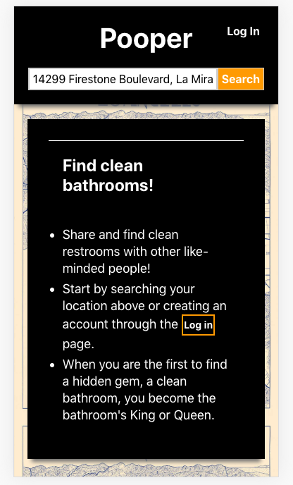

# Pooper-api

## Link

[https://pooper-gbertkim.vercel.app/](https://pooper-gbertkim.vercel.app/)

Client-side: 

[https://github.com/gbertkim/pooper](https://github.com/gbertkim/pooper)

## Description

Pooper is a web app/project made to upload and find clean bathrooms near you. Using Google Places API, users can find bathroom locations and rate their bathroom experiences. 

The client side of this app is built using REACT. The backend is built using NODE and POSTGRESS which allows for CRUD operations. There are 3 database tables: accounts, bathrooms, and reviews. 

## Stack

HTML, CSS, JavaScript, Google Places API, React, Node, Postgres, Express, Jsx

## Snapshots

Example of the start page. From here users are informed of what the app is and may log in, create an account, or search their address using the search bar. 

Example of the search results with filter options. The user may add a bathroom or delete/update a bathroom they had previously created

When a bathroom is clicked, a bathroom's list of reviews is loaded. The user may then add a review or delete/update a review they had previously created. 

The web app is responsive.

